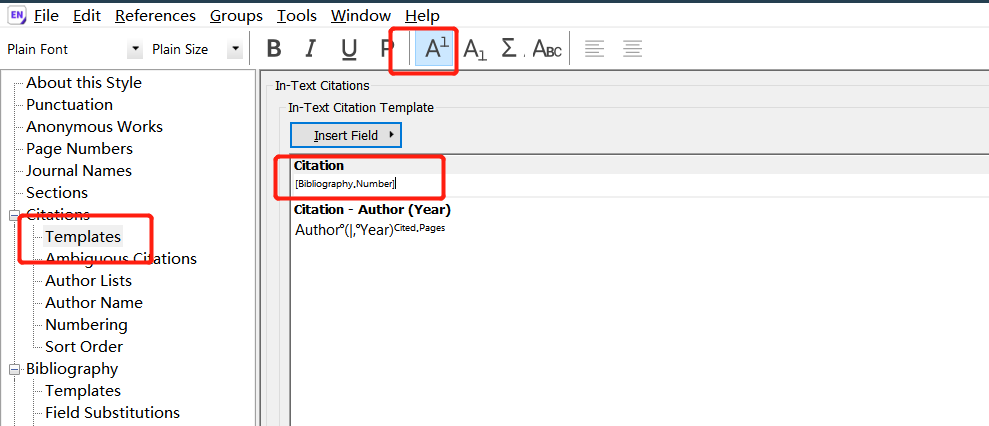
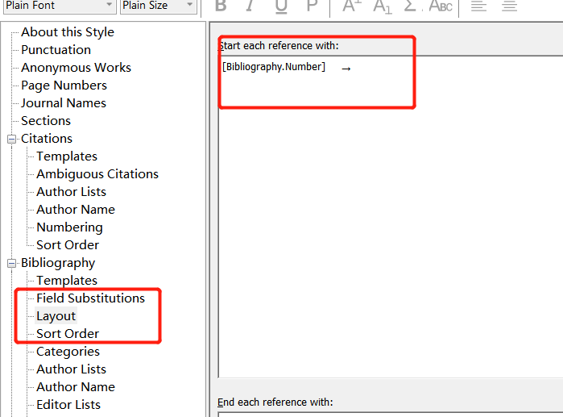
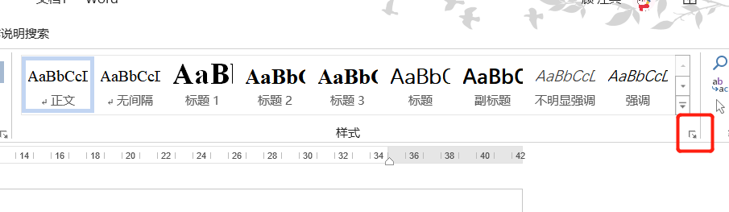
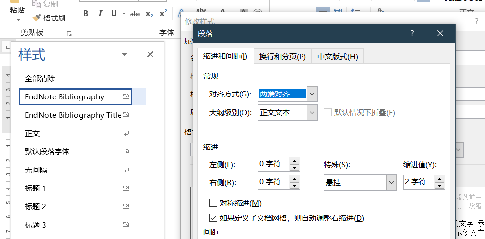

1. 官网下载endnote_style:**GBT7714.enl**(其他版本可能也行)
2. 将文件放入endnote的安装主目录下的**style**中
3. 修改endnote格式
   进入修改格式步骤：
   1. 先选择导入的格式
   
   2. Edit->Output Style -> Edit *****
   
   3. 修改正文中的引用格式
   
    在第一行里面修改为`[bibliography number]`,同时设置为上标
   4. 在layout中设置序列号
   
   上面的**bibliography number **和**制表位**在该页的右上角**insert field**插入
   5. Bibliography中的Sort Order选择第一个
   6. 修改word中引用文献格式
    引用文献格式在样式中是看不见的，需要点击右下角的角标
    
   7. 在格式中下拉可以看见对应的样式，进行修改
   一般只要将段落中设置为悬挂缩进2个字符就行,其他例如字体，段落就按照自己所需要的进行设置
   