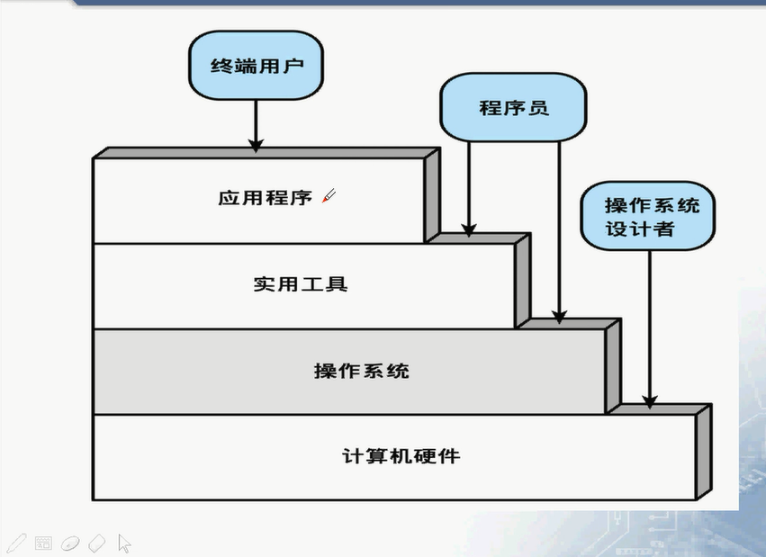
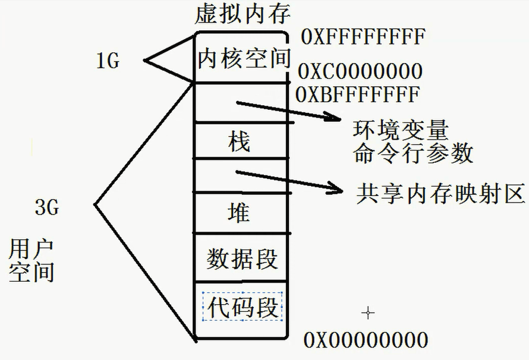

# 计算机的基本组成
.jpg)
* 处理器

包括：程序计数器、指令寄存器、MAR(存储器地址寄存器)、MBR(存储器缓冲寄存器)
MAR（存储地址寄存器）：确定下一次读写的存储器
MBR(存户缓冲寄存器)：写入存储区的数据；从存储器中读出的数据
程序寄存器（PC）：获取指令的地址，自动获取下一个地址的指令
指令寄存器（IR)：存储指令的内容
寄存器还分为：可见寄存器（数据寄存器）和不可见寄存器（PC、IR）

* 主存储器
    1. 易失性
    2. real memory OR primary memory（实存储器或者主存储器）
存储指令、数据

* 输入输出模块（I/O模块）
    1. 二级存储设备（U盘）
    2. 通信设备（手机）
    3. 终端

里面存在缓冲区，提高计算器数据处理的能力

* 系统总线（System Bus）
    1. 为处理器，主存 和输入/输出模块间提供通讯的设施
    2. 控制总线、数据总线、寻址总线

# 指令周期
* 处理器执行的程序由一组指令组成
* 一个单一的指令称为一个指令周期
* 一个指令的执行需要两个步骤
  * 处理器从存储区读一个指令

    处理器从程序寄存器保存的寄存器地址中取地址，放在指令寄存器中。
  * 处理器执行指令

    处理器解析IR中的指令并执行对应操作，这些操作分为四类
    1. 处理器-存储器

    在存储器和处理器之间传递数据
    2. 处理器-I/O

    处理器和I/O模块间传递数据
    3. 数据处理

    数据的算术操作和逻辑操作
    4. 控制

    改变执行顺序

# 理想计算器特征
1. 前4位是操作码，后12位是地址
2. 整数格式
3. 内部CPU寄存器
4. 部分操作码列表

# 操作系统
1. 应用程序和系统硬件之间的接口
2. 控制应用程序执行的程序
3. 操作系统与普通的计算机软件相同
   1. 由处理器执行的一段和一组程序
4. 操作系统经常释放控制，并且必须依赖于处理器才能回去空间

## 计算机系统的层次视图

1. 操作系统与计算机硬件进行交互
2. 实用工具与操作系统，例如C语言中很多的库，字符串库，IO处理库
3. 应用程序进行开发交互给终端用户
   
## 操作系统提供的服务
1. 程序开发
2. 程序执行
3. IO设备访问
4. 文件访问控制
5. 系统访问
6. 错误监测和响应
   1. 内部外部的硬件错误
   2. 软件错误
   3. 操作系统无法确认应用程序的请求

## 操作系统的主要特性
1. 易扩展性

    软件扩展和硬件扩展
2. 并发性

    可以多用户登录执行若干相同的程序
3. 共享性

    可以多个程序访问控制同一个资源
4. 异步性

    就是不需要等到消息回复可以直接发送新的消息
5. 虚拟性

    在硬盘中开辟一块临时区域放不怎么用的内存数据，则这块临时区域称为虚拟内存

## 操作系统的发展
1. 串行处理
2. 简单批处理系统

    相对于串行处理多了一个监视程序，但是监视程序需要很大一块内存空间
    称为单道批处理系统
3. 多道程序批处理系统

    多道程序可以在A程序wait的时候，B程序开始执行，涉及到内存的管理
4. 分时系统
   
   通过分时系统的技术，合理的运行多个程序

# 现在操作系统的特征
1. 微内核体系结构

    操作系统具有一个大内核，相对应的还有微内核，为内核提供一些简单的操作。
2. 多线程

3. 对称多处理

    多个处理器可以共享同一个IO以及主存储器
4. 分布式操作系统
5. 面相对象设计

# Linux操作基本构成
## 内核
* 操作系统的核心，负责管理系统的进程、内存、设备驱动程序、文件和网络系统
* 控制系统和硬件之间的相互通信
* 决定着系统的性能和稳定性

可以通过终端查看内核源码

## shell
命令终端打开的软件就是shell，输出的命令会交给kernel

## 文件系统
根从一个/开始

## 应用

# Linux操作系统的基本概念
## 文件和文件系统
* 文件：数据或这杯的一种逻辑组织
* 文件系统：文件间关系的一种逻辑组织

## 程序和进程
* 程序：计算机执行的指令集合
* 进程：程序的一个运行实例，操作系统资源分配的最小单位
* 进程很占用资源

## 线程
* 程序运行的基本单位，一个进程内部可以有一或若干线程同时运行
* 线程基本不占用资源
## 信号
Linux系统中进程通信的一种技术，异步程序设计的基础

## 客户端和服务器

# linux启动流程
启动有个关键的程序bootHeader
* 芯片和部分外围电路的初始化
* 加载内核
* 加载最小文件系统
* 加载硬盘上的根文件系统
* 启动1号进程/sbin/init

`ls /`加载根文件系统

## bootloader
* 严重依赖于硬件，在嵌入式开发中里建立一个通用的BootLoader几乎是不可能的
  
## init进程（重要）
* linux系统启动的第一个进程，0号进程为内核进程（swapper进程）
  * 执行/etc/init.d目录中的所有脚本文件，启动某些系统的服务
  * 执行/sbin/getty 初始化0、1和2（初始化标准化输入、输出和错误）
  * 执行/bin/login启动用户登录程序
  * 管理孤儿进程（孤儿进程：父进程已经结束掉了）

# 内存管理（虚拟内存）
C++,C中涉及到的内存都是虚拟内存，所用到的地址都是虚拟地址
32位的芯片所以虚拟内存空间就是2的32次方

高地址部分：虚拟内存中有一个G放置内核空间
低地址部分：剩余空间3G
剩余的3G内存空间，从高往低，首先是**环境变量，命令行参数**，下面是**栈**，再下面是共享内存映射区，**再往下就是堆空间**，再往下就是**数据段**，最后就是**代码段**。

数据段构成：
* 静态存储区：存放程序中用到的全局变量，静态变量（全局和局部）
  * 初始化区
  * 未初始化区
* 常量区

虚拟内存与物理内存之间的交互通过MMU进行交换数据

* 进程隔离：保护独立的进程，防止互相干涉数据和存储空间
    每个进程都有单独的4G内存大小进行分配
* 自动分配和管理：动态地分配，分配对程序员是透明的
* 支持模块化的程序设计：能够定义程序模块，并且动态地创建、销毁模块，改变模块大小
* 保护和访问控制：允许一部分内存可以由各种用户以各种方式进行访问
* 长期存储：关机后时间保存信息

## 虚存寻址
交换内存就是在硬盘中额外开辟的内存大小

## 段页式内存管理
虚拟内存分为若干块，每块分为若干页，整个从虚拟内存映射到物理内存通过页进行映射，一页通常是4k大小。
* 进程在虚拟内存中分为代码段、数据段和堆栈段
* 进程在段中有许多固定大小的快组成，这些快成为页
* 虚拟地址由段号、页号和页中偏移量构成
* 虚拟地址和贮存区中实际地址的动态映射
* 缺页
  * 消除了进程全部载入内存中
  * 按需调页

# 系统调用
系统调用时指操作系统提供给用户程序的一组特殊接口，用户程序可以通过这组特殊接口来获得操作系统内核提供的特殊服务

## Linux进程的运行状态
* 内核态（系统调用会将内核变成内核态）
  * 进程运行在内核空间
* 运行态（用户态）
  * 进程运行在用户空间

# UNIX标准
* IOS C
* IEEE POSIX
  * linux中用户编程（API）遵循了在UNIX中最流行的应用编程界面标准-POSIX标准。这些系统调用编程接口主要通过C库（libc）实现的