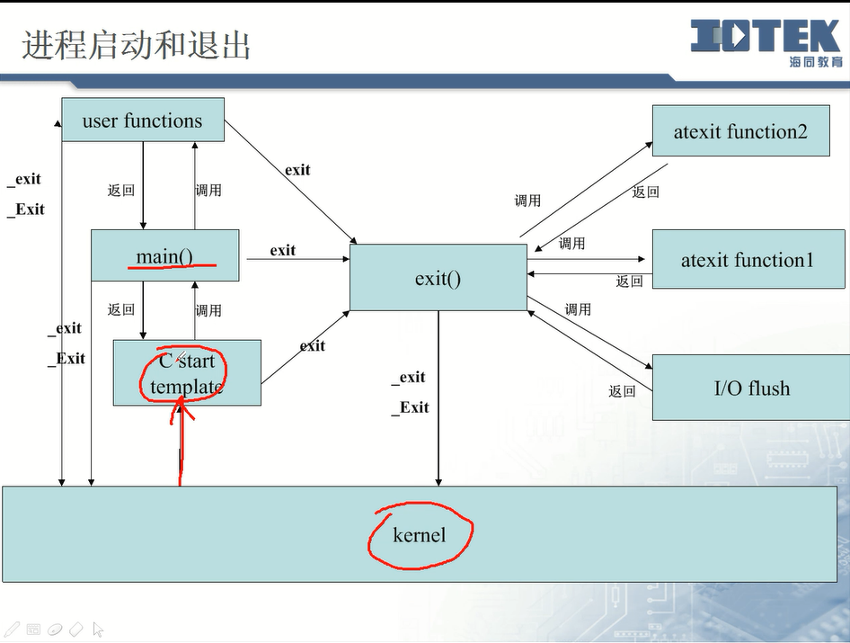
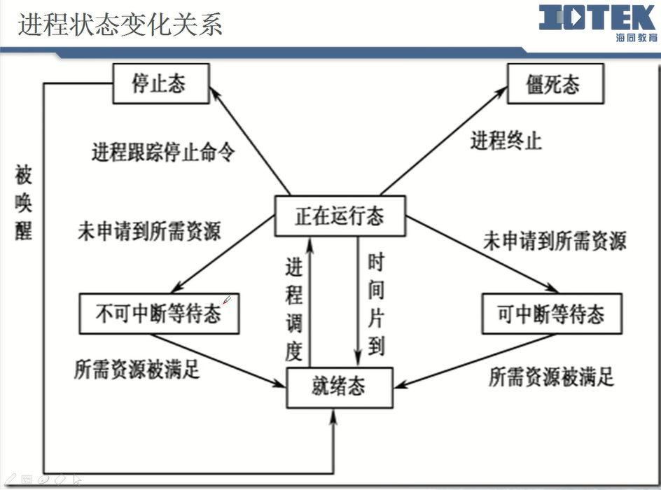

[TOC]
# 程序和进程

* 程序是存放在磁盘中的可执行文件
* 进程
  * 程序的执行实例被称为进程
  * 进程具有独立的权限与职责、如果系统中某个进程崩溃，它不会影响到其余的进程
  * 每个进程运行在各自的虚拟地址空间中，进程之间可以通过由内核控制的机制相互通讯
* 进程ID
  * 每个Linux进程都一定有一个唯一的数字标识符，称为进程ID，进程ID总是一个非负整数
  
# 内核中的进程结构
==进程表项==
task_struct ==> 结构体 （进程表项或称为进程控制块）
* state：状态
* flags：
* need_resched:
* priority:
* mm（memory management）:进程管理的信息
* tty：
* signal_lock：信号处理的结构体
* file_struct:指向文件描述符表

# C程序启动过程

* 内核启动特殊户例程
* 启动例程
  * 在进程main函数执行之前内核会启动
  * 该例程放置在/lib/libc.so
* 启动例程
  * 搜集命令行的参数传递给main函数中的argc和argv
  * 搜集环境信息构建环境表并传递给main函数
  * 登记进程的终止函数
  
# 进程终止方式

* 正常终止
  * 从main函数返回
  * 调用exit(标准C库函数)
  * 调用_exit或_Exit(系统调用)
* 异常终止
  * 调用abort
  * 接收到一个信号并终止
  * 最后一个线程对取消请求做处理响应
* 进程返回
  * 通常程序运行成功返回0，否则返回非0
  * 在shell中可以查看进程返回值（echo $?）

atexit()函数
```C++
int atexit(void (*function)(void));
```
* 每个启动的进程都默认登记了一个标准的终止函数
* 终止函数在进程终止时释放进程所占用的一些资源
* 登记的多个终止函数执行顺序是以栈的方式执行，先登记的后执行

终止方式：
1. return
    * 刷新了标准I/O缓存
    * 自动调用终止函数
2. exit()
    在调用的时候调用了内部的函数_exit()和_Exit();
    * 刷新了标准I/O缓存
    * 自动调用终止函数(atexit function2,atexit function1, I/O flush)
3. _exit()/_Exit()
    * 不会刷新标准I/O缓存
    * 不会自动调用终止函数


# 非局部跳转

# 进程资源限制

# 进程创建、执行和终止

```C++
pid_t fork(void);   // 子进程中位0，父进程中为子进程ID，出错为-1
pid_t vfork(void);  // 子进程中为0，
```
* fork创建的新进程被称为子进程，该函数被调用一次，但是返回两次，两次返回的区别是：**在子进程中的返回值是0，而在父进程中返回值则是新子进程的进程ID**
* 创建子进程，父子进程哪个先运行根据系统调度且复制父进程的内存空间
* vfork创建子进程，但子进程先运行且不复制父进程的内存空间

## 进程的继承
所有进程系统分配的4G虚拟内存地址都是一样的

父进程fork子进程
子进程会继承父进程的一些信息
* 子进程的继承属性：用户信息和权限、目录信息、信号信息、环境、共享存储段、资源限制、堆、栈和数据段、共享代码段
  * 正文段在物理空间是共享的
  * 数据段，堆，栈，都是全部拷贝过去，然后映射到不同的物理内存
* 子进程特有属性
  * 进程ID，锁信息，运行时间，未决信号
* 操作文件时的内核结构变化
  * 子进程**只继承父进程的文件描述表**，不继承但共享文件表项和i-node
  * 父进程创建一个子进程后,文件表项中的引用计数器加1变成2，当父进程作close操作之后，计数器减1，子进程还是可以使用文件表项，只有当计数器为0时才会释放文件表项。

缓存主要是在堆中
# 进程类型

# 进程状态
PS查看进程状态
* -ef 查看所有的进程 ps -ef | more 
```C++
UID        PID  PPID  C STIME TTY          TIME CMD
root         1     0  0 Oct10 ?        00:52:21 /sbin/init
root         2     0  0 Oct10 ?        00:00:00 [kthreadd]
root         3     2  0 Oct10 ?        00:00:02 [migration/0]
root         4     2  0 Oct10 ?        00:00:57 [ksoftirqd/0]
```
UID:User ID
PID：process ID
PPID：父进程
Stime：Start time

* -aux | more
```C++
USER       PID %CPU %MEM    VSZ   RSS TTY      STAT START   TIME COMMAND
root         1  0.1  0.0  19364  1536 ?        Ss   Oct10  52:21 /sbin/init
root         2  0.0  0.0      0     0 ?        S    Oct10   0:00 [kthreadd]
root         3  0.0  0.0      0     0 ?        S    Oct10   0:02 [migration/0
]
root         4  0.0  0.0      0     0 ?        S    Oct10   0:57 [ksoftirqd/0
```
* user: 进程的属主
* PID
* CPU：进程占用CPU百分比
* MEM：占用内存的百分比
* Ni：进程的nice值，数值大，表示较少的占用cpu时间
* VSZ: 进程虚拟大小
* RSS：驻留中页的数量
* TTY：z终端ID
* wchan：正在等待的进程资源
* start：启动进程的时间
* time：进程消耗CPU的时间
* command：命令的名称和参数


进程常见的状态：
* 运行状态
    * 系统当前状态
    * 就绪状态进程
    * PS命令的stat列为R
* 等待状态
    * 等待时间发生
    * 等待系统资源
    * ps 命令的stat列为s（可中断的等待），如果是不可中断的等待是D
* 停止状态
    * ps命令的stat列为值T
* 僵尸状态
    * 进程终止或结束
    * 在进程表项中仍有记录
    * PS 命令的stat列为值Z
# 进程组

# 进程的调度
多用户：多个用户执行同一个进程
多任务：同一个用户可以执行多一个进程

进程会被CPU分配时间片，分时系统，分配的优先级决定分配的先后，所以涉及到内存的**交换**
1. 处理内核中的工作
2. 处理当前进程
3. 选择进程
    * 实时进程
    * 普通进程
4. 进程交换

分配策略
* 策略
    * 轮流策略
    * 先进先出策略
* 优先权
    * Jiffies变量
* 实时优先权
    * 实时进程之间
* 计数器

进程状态变化关系
正在运行态  当时间片到 切换到就绪态  
正在运行态  进程终止，但是在进程表还有信息  就会到将死态
停止态（进程跟踪命令），不能直接到正在运行态，先到就绪态
等待状态又可称为阻塞状态或者挂起
单个cpu只能运行一个进程，只能相互切换的时间过快，宏观上感觉不出来


## 进程标识
实际用户：是指登录linux的时候的用户
有效用户：是指进程的执行用户
```C++
pid_t getpid(void);
uid_t getuid(void);    // 或者当前进程的实际用户ID
uid_t geteuid(void);   // 获取当前进程的有效用户ID
gid_t getgid(void);    // 获得当前进程的用户组ID
pid_t getppid(void);   // 获得当前进程的父进程ID
pid_t getpgrp(void);   // 获得当前进程所在进程组的ID
pid_t getpgid(pid_t pid); //获得进程ID为pid所在进程组的Id
```


#  进程链和进程扇
进程链：子进程fork出孙进程...
进程扇：父进程fork出多个子进程，进程扇

# 进程守护
* 守护进程是生存期长的一种进程，他们常常在系统引导装入时启动，在系统关闭时终止
* 所有守护进程都以超级用户的优先权运行
* 守护进程没有控制终端
* 守护进程的父进程都是init进程

# 孤儿进程
* 父进程结束，子进程就成为孤儿进程，会由1号进程（init进程）领养
```C++
    pid_t pid;
    pid = fork();
    if (pid < 0)
    {
        perror("fork error");
        exit(1);
    }
    else if (pid > 0)
    {
        printf("%d deaded \n", getpid());
        exit(0);// 父进程终止运行
    }
    else
    {
        // child process
        sleep(4);
        printf("pid: %d, ppid: %d \n", getpid(), getppid());
    }
```
运行结果
```C++
[d5000@open-ies01 process]$ process_orphen 
40832 deaded 
[d5000@open-ies01 process]$ pid: 40833, ppid: 1 
```

# 僵尸进程
状态是Z,且末尾有一个defunct，就是僵尸进程
* 子进程结束但是没有完全释放内存（在内核中的task_struct没有释放），该进程就成为僵尸进程，就是需要等待父进程wait子进程的退出消息
* 当僵尸进程的父进程结束后就会被init进程领养，最终被回收
* 避免僵尸进程
    * 让僵尸进程的父进程来回收，父进程每隔一段时间来查询子进程是否结束并回收，调用wait()或者waitpid(),通知内核释放僵尸进程。
    * 采用信号sigchid通知处理，并在信号处理程序中调用wait函数
    * 让僵尸进程称为孤儿进程，由init进程回收
```C++
d5000    14074  0.0  0.0  11744   936 pts/13   S+   10:00   0:00 bin/process_zombie
d5000    14075  0.0  0.0      0     0 pts/13   Z+   10:00   0:00 [process_zombie] <defunct>
```

可以采用kill -9将进程杀死
```C++
[d5000@open-ies01 process]$ bin/process_zombie 
pid :46180,ppid:46179
已杀死
```

## wait函数


```C++
#include <sys/types.h>
#include <wait.h>

pid_t wait(int *status);
// 返回：成功返回子进程ID，出错返回-1
// 功能：使得父进程阻塞，等待子进程退出并回收，防止僵尸进程产生

pid_t waitpid(pid_t pid, int * status,int options);
// 返回：成功返回子进程Id，出错返回-1；
// 功能：wait函数的非阻塞版本

```
wait和waitpid函数的区别
* 在一个子进程终止前，wait使其调用者阻塞
* waitpid有一选择项，可使调用者不阻塞
* waitpid等待一个指定的子进程，而wait等待所有的子进程，返回任一终止子进程的状态

参数：
* status：为空时，代表任意状态结束的子进程，若不为空，则代表指定状态结束的子进程
* 检查wait和waitpid函数返回终止状态的宏
  * WIFEXITED/WEXITSTATUS(status)
    * 若为正常终止子进程返回的状态，则为真
  * WIFSIGNALED/WTERMSIG(status)
    * 若为异常终止子进程返回的状态，则为真（接到一个不能捕捉的信号）
  * WIFSTOPED/WSTOPSIG(status)
    * 若为当前暂停子进程的返回的状态，则为真
* Option参数
  * WNOHANG
    * 若由pid指定的子进程没有退出则立即返回，则waitpid不阻塞，此时其返回值为0
  * WUNTRACED
    * 若某实现支持作业控制，则由pid指定的任一子进程状态已暂停，且其状态自暂停以来还未报告过，则返回其状态 

# exec函数
* 在用fork函数创建子进程后，**子进程**往往要调用一种exec函数以执行另一个程序，因为是用新代码替换原有的代码，所以得在子进程调用比较好
* 当进程调用一种exec函数时，该进程完全由新程序代换，替换原有进程的正文，而新程序则从其main函数开始执行，因为调用exec并不创建新进程，所以前后的进程ID并未改变，exec只是用另一个新程序替换了当前进程的正文、数据、堆和栈段。
* 本质就是代码替换

## exec系列函数
* `int execl(const char *pathname, const char *arg0...)`
* `int execv(const char *pathname, chaar const argv[])`
* `int execle(const char * pathname, const char* arg0,  char * const envp[])`
* `int execve(const char *pathname,char * const argv[], char * const envp[])`
* `int execlp(const char *pathname, const char *arg0...)`

* 第一个参数就是需要执行的程序，可以是相对路径也可以是绝对路径，最后一个参数一定要是null
* execve函数为系统调用，其余为库函数，执行execve函数，后面的代码不执行
* l:l代表参数列表
* v:v代表传递的参数数组，最后一个元素为NULL
* e：envp为进程的环境表，函数中有e，说明在函数中最后一个参数就是环境表
* p: 第一个参数需要的是执行的新程序的路径，有p则第一个参数可以用相对路径也可以用绝对路径，不带p的话，只能用绝对路径

返回：出错返回-1，成功则不返回

## exec系列函数的相互关系
* execlp构造argv调用execvp，execvp调用execv，execv调用execve(系统调用)
* execl构造argv调用execv，execv调用execve(系统调用)
* execle会调用execve
**不管调用哪个库函数，最后都是调用execve**

# system函数
```C++
#include   <stdlib.h>
int system(const char *command)
// 成功返回执行命令的状态，出错返回-1
// 简化exec函数的使用
```
* system函数内部构件一个子进程，由子进程调用exec函数
* 等同于/bin/bash -c "cmd"或者exec("bash","-c","cmd");

