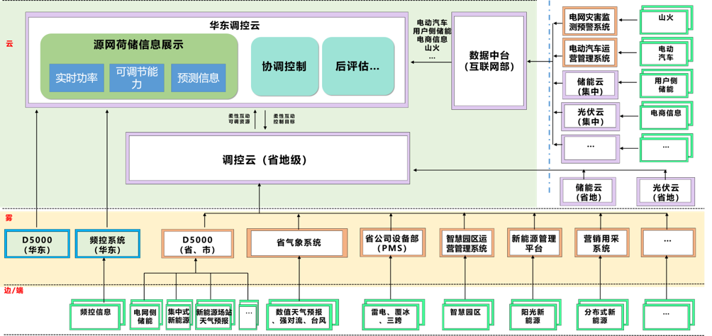
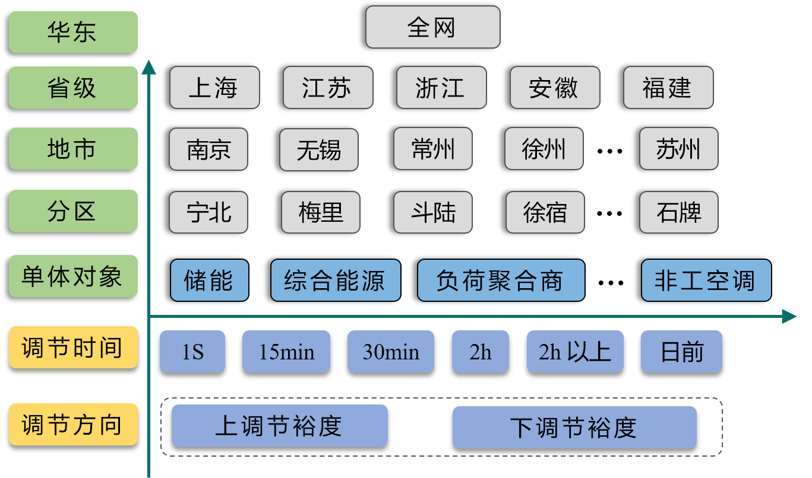

[TOC]
# 源网荷储多远协调调度控制系统的典型应用
问题：
1. 

## 背景

### 华东电网运行现状（江苏、安徽、福建、浙江、上海）
1. 风光装机容量增加，对电网的==调峰，调频，调压和潮流控制==均造成困难
2. 至2018年底，==华东区外直流总容量==达到6976万千瓦，超过华东全年最高用电负荷1/4，工作日低谷负荷的1/2。
3. 分布式新能源的实时信息采集和预测仍是短板
4. 电网为满足该==很短时间的尖峰负荷==增加了巨大的输电网和变电容量投资。

### 需求分析
1. 管控能力不足
   华东地区分布式光伏“盲调”现象普遍，调管范围内分布式光伏信息采集率仅为54.7%，其中无线采集达45.9%，数据实时性、可靠性较差，对==分布式能源管控能力不足==。

2. 调峰问题突出
   随着特高压工程投运，浙江、江苏、安徽等省==受端电网==特征明显，分布式光伏爆发式增长，与集中式光伏、风电、水电等易形成叠加效应，加剧了电网调峰困难。

3. 新能源消纳难度大（新能源波动性较大，对控制调节提出了调整）
   新能源随机性、波动性强，出力剧烈变化导致==电网断面潮流过载==，需要常规电源频繁跟随调整，系统调节能力严重不足，常规能源与新能源“抢通道”问题突出。

## 总体建设方案
建立==源网荷储资源综合管理平台==，根据电网不同运行场景，充分挖掘==电网侧、电源侧、可调控负荷、储能==四类可调控资源，建立==源网荷储高度协同互动模式==，通过发电、可调度负荷和储能的协同调度，==实现电力供需瞬时、短时、时段平衡==，并最大化利用清洁能源。

总体可分为四部分：
   1. 信息采集
      电动汽车、智慧园区、储能、新能源、
   3. 资源池构建
      空间、时间、资源类型  
   5. 协调优化
      新能源消纳协调优化、通道越限协调优化、安全校核 
   7. 信息发布
      需求发布、可控资源信息发布、需求申报

## 泛在资源信息汇集及展示

### 场景概述

### 信息接入和监视
#### 信息汇集
1. 单体
   * 分布式光伏
   * 集中式光伏
   * 电动汽车
   * 储能
   * 智慧园区
   * 光伏云
2. 实时数据
   * 有功
   * 无功
   * 可调节能力

####  聚合信息
1. 空间聚合
   * 全网
   * 省市
   * 地区
   * 分区
   * 厂站
2. 时间聚合
   * 秒级
   * 15分钟级
   * 30分钟级
   * 2小时级
   * 2小时级以上

#### 集中监视
   * 空间维：按照资源在地理位置的分布进行统计及展示
   * 时间维：根据资源在不同时间尺度的属性进行统计及展示
   * 对象维：按照源网荷储不同的资源类型进行统计及展示

### 泛在资源池构建
在单体对象属性的基础上，从空间和时间两个维度构建负荷资源聚合，对单体调节资源进自动聚合，形成不同层级、不同时间、不同对象的负荷调节资源对象，为后续的监视控制、分析计算和优化决策提供统一的负荷资源池服务

### 可视化展示
1. 首页：地理示意图：展示实时负荷曲线、新能源实时出力、泛在资源信息汇总、资源总览
2. 同里能源站展示：园区概况、新能源发电、协调控制，还有并网、可调能力、负荷用电曲线等运行特性信息
3. 电动汽车

## 泛在资源参与电网调峰需求响应

### 新能源消纳协调优化

### 日前需求响应
1. 安徽、江苏需求上报给平台
2. 平台需求发布给同里和电动汽车
3. 同里和电动汽车需求申报
4. 平台申报确认
5. 联络线计划调整

### 日内需求响应
#### 变化不大的情况
1. 安徽、江苏需求上报给平台
2. 平台需求发布给同里和电动汽车
3. 同里和电动汽车需求申报
4. 平台申报确认
5. 联络线计划调整

#### 变化较大的情况
1. 同里和电动汽车重新申报响应量
2. 平台申报确认
3. 联络线计划调整

### 电动汽车

#### 接入方法
#### 数据交互
##### 模型数据
（1）电动汽车基本信息表：电动汽车名称，所属地区，所属分区；
（2）可调度负荷类型表：新增电动汽车类型。

##### 实时数据
可调度负荷实时可调节特性信息表：当前功率，电动汽车公司内部可调资源响应按照96点计划类型时间划分，每个时间段上调资源裕度、下调资源裕度、维持时间等。

#### 响应流程

### 同里综合能源体
#### 模型数据上云
#### 数据传输方式
#### 控制流程
1. 总体流程
2. 交互数据格式
3. 需求/控制数据传输路径
4. 需求/控制请求确认
5. 综合能源接收确认交互方式

### 功能验证
上行数据：泛在资源实时数据，需求申报
下行数据：需求发布、计划值
1. 信息接入及展示
2. 调节需求发布、调节需求申报确认
3. 调节策略计算计划值下发
4. 调节结果展示

### 可视化展示

## 四级调度新能源消纳能力分析

### 场景概述
1. 周计划阶段（负荷发电、周预测）
   1. 淮宿分区
      分区新能源消纳空间
      分区机组可调下限
   2. 安徽全网
      省调新能源消纳空间
      省调机组可调下限
      华东下发联络线计划

2. 日前计划阶段（负荷发电、周预测）
   1. 淮宿分区
      分区次日新能源消纳空间

   2. 安徽全网
      次日新能源消纳空间

      华东次日联络线计划

      华东需求响应邀约
3. 日内阶段
   1. 淮宿分区
      分区内机组调整
      分区内新能源AGC启动

   2. 安徽全网
      4小时新能源消纳空间
      华东第二批次需求邀约
      新能源AGC启动

### 评价指标
#### 新能源消纳能力技术指标
1. 
   1. 最小技术出力
   2. 发电机组(发电厂)向下调节能力
   3. 电网向下调节能力
   4. 省级电网消纳能力
   5. 区域电网消纳能力
2. 1. X省送Y省消纳裕度
   2. X省跨省消纳裕度
   3. X省经A 通道送Z区域消纳裕度
   4. X省跨区消纳裕度

#### 新能源消纳能力评估策略
**典型日分析法**：计算过于保守，不利于提高新能源实际上网电力电量
**随机生产模拟法**：忽略了与时序相关的约束，无法全面分析生产成本
**时序生产模拟法**：模拟各发电机组的运行状况，并计算发电系统生产费用的时序仿真方法

